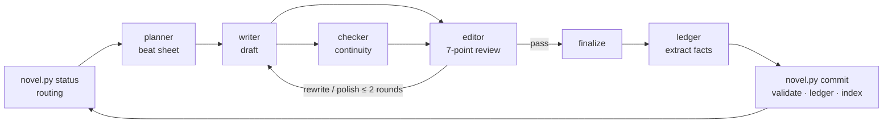

# novel-harness: write long-form fiction with AI agents

[简体中文](README.md) · **English**

[](LICENSE)
[](https://www.python.org/)
[](tools/novel.py)
[](#claude-code-plugin)

A toolkit for writing novels of 100+ chapters with coding agents. Seven sub-agents split the work
(planning, drafting, checking, editing, bookkeeping), and a small Python fact layer keeps track of the
timeline, plot threads, what each character knows, and style statistics.
It's built for Chinese web fiction first, but the genre is up to you.
It ships as a Claude Code plugin and also runs in Cursor, Codex, OpenCode, Antigravity and Pi.

## Why

Short stories are fine with an LLM. Around chapter 80 things fall apart: who got the dagger in chapter 12,
whether Lao Zhou knows the protagonist's real identity, whether a foreshadowed plot point ever paid off.
The model has long forgotten. The root cause is leaving continuity to the model's context window.

So this project keeps books. After each chapter is final, a ledger agent extracts structured facts
(who is where, which in-story day it is, who learned what, which thread moved), and only code may write
them to the ledger. Before the next chapter, the tool pulls the relevant backstory, character state and
open threads into a context pack for the writer. Contradictions show up as errors from code.

## What's in it

- A seven-role pipeline: architect plans volumes and arcs, planner writes the beat sheet, writer drafts,
  checker reviews continuity, editor scores the draft on seven dimensions with concrete revision notes,
  ledger extracts facts, judge blind-compares the before and after of a revision.
- A fact layer in `tools/novel.py`, one file, standard library only:
  - progress routing and context assembly
  - scene-level full-text search with SQLite FTS5 and CJK bigram tokens, so two-character names still match
  - timeline checks counted in in-story days
  - a plot-thread registry with a promise and a payoff window per thread
  - a per-character knowledge ledger
  - style stats for overused words and stock phrases
- Three review gates: stop per arc, per chapter, or run on its own. It always stops after generating the setting.
- You can step in at any time: change the voice, change direction, redo a chapter, stop at chapter N.
- Drafts are linted as soon as they're written and fact files are validated on write; problems go straight back to the model.
- One set of role definitions, generated into the native sub-agent format of each runtime.
- Ledgers are JSON / JSONL and chapters are Markdown, so the whole workspace is a git repo you can diff and roll back.

## Architecture

The fact layer only does what code can decide. Anything that needs judgement goes to an agent.

| | Fact layer | Semantic layer |
|---|---|---|
| Owner | `tools/novel.py` (stdlib, one file) | the seven roles in `agents/` |
| Does | routing, ordering, thread deadlines, knowledge ledger, style stats, fact validation | planning, writing, checking, reviewing, extraction |
| Result | decided by code, one answer | judgement, may disagree |

The main session only orchestrates: read facts, ask for the route, dispatch a sub-agent, validate its output,
advance state. It doesn't write prose, make literary calls, or edit ledgers by hand.



### Plugin and workspace

```
novel-harness (this repo, install once)  my-novel/ (one folder per novel, created by init)
├── agents/      seven roles            ├── CLAUDE.md        entry point to docs/protocol.md
├── skills/      six /novel-* skills    ├── docs/protocol.md orchestration ┐ copied per version,
├── hooks/       post-write checks      ├── docs/schemas.md  data contract │ refreshed by upgrade
├── tools/novel.py                      ├── tools/novel.py                 ┘
├── docs/        protocol + schemas     ├── bible/ outline/ threads/   canon (written by architect)
└── templates/workspace/  seed files    ├── chapters/ plans drafts reviews final facts
                                        └── ledger/ state/ summaries/ index/   written by novel.py only
```

Each workspace carries its own copy of `tools/novel.py` and the data contract, matching its data format.
Updating the plugin won't change how an existing novel behaves; run
`python3 <plugin dir>/tools/novel.py upgrade` inside the workspace when you want the new version.

## Install

Python 3.10+, standard library only. Nothing to `pip install`.

### Claude Code plugin

The repo is its own marketplace:

```
/plugin marketplace add hoobnn/novel-harness
/plugin install novel-harness@novel-harness
```

For local development, `git clone` it and run `claude --plugin-dir ./novel-harness`.

### npx skills

For Cursor, Codex, OpenCode, Antigravity and Pi, or Claude Code without the plugin:

```bash
npx skills add hoobnn/novel-harness
```

This installs the six skills only. The first time you run `novel-init`, `init.sh` notices it isn't inside
the plugin, shallow-clones this repo to `~/.cache/novel-harness/src`, and initializes in standalone mode:
it generates the seven sub-agent definitions for your runtime, copies the skills, and installs the hooks.
Later, `python3 tools/novel.py upgrade` refreshes from that cache. Set `NOVEL_HARNESS_SRC` to an existing
checkout to skip the clone; `--runtime cursor,codex` limits generation to the runtimes you name.

| Runtime | Skill entry | Sub-agent files (standalone) | How to dispatch |
|---|---|---|---|
| Claude Code plugin | `/novel-harness:novel-next` | bundled | Agent tool, `novel-harness:writer` |
| Claude Code standalone | `/novel-next` | `.claude/agents/*.md` | Agent tool, `writer` |
| Cursor | `/novel-next` | reads `.claude/agents/` natively | `/writer` or name it |
| Codex | `$novel-next` | `.codex/agents/*.toml` | name the role in the prompt |
| OpenCode | `skill` tool | `.opencode/agents/*.md` | `@writer` |
| Antigravity | `/novel-next` | `.agents/agents/*.md` | `invoke_subagent` |
| Pi | `/skill:novel-next` | `.pi/agents/*.md` (needs the official subagent extension) | name it |

Per-runtime folders, field mappings, sources and what hasn't been tested yet are in
[`docs/runtimes.md`](docs/runtimes.md) (Chinese).

### No install

Inside your novel folder, run `python3 /path/to/novel-harness/tools/novel.py init --standalone`.
Roles and skills are generated into that folder, and slash commands drop the `novel-harness:` prefix.

## Quick start

Open Claude Code in an empty folder (your novel):

```
/novel-harness:novel-init An Eastern fantasy epic, the hero starts in a frontier town, aim for 200 chapters
```

It sets up the workspace and has the architect write the foundation: premise, world rules, calendar,
character sheets, plot threads, the first arc's outline and a style guide. Then it stops so you can read
`bible/`, `outline/` and `threads/`. Edit until you're happy, then continue:

```
/novel-harness:novel-next                      # advance until the next gate (per arc by default)
/novel-harness:novel-next 20                   # keep going to chapter 20
/novel-harness:novel-status                    # progress, thread health, style stats
/novel-harness:novel-steer move the romance up to chapter 4
/novel-harness:novel-sync                      # rebuild ledgers after editing chapters/final by hand
/novel-harness:novel-arc-review v1a2           # run or redo an arc / volume review
```

Make the workspace a git repo. The main session runs `git commit` after each chapter, so every change is traceable.

## Roles and the per-chapter pipeline

| Role | Input | Output |
|---|---|---|
| architect | brief / backstory / thread registry | `bible/` `outline/` `threads/` |
| planner | `context N --for planner` | `chapters/plans/chNNNN.md` |
| writer | chapter plan + context pack | `chapters/drafts/chNNNN.md` |
| checker | draft + ledgers | `chapters/reviews/chNNNN.check.json` |
| editor | draft + checker result | `chapters/reviews/chNNNN.json`, arc / volume summaries |
| ledger | final chapter | `chapters/facts/chNNNN.json` |
| judge | two versions of a chapter | blind verdict |

architect, planner, writer, editor and judge use the main session's model; ledger and checker do extraction
and checking on a cheaper model. Change it in the `model` field of `agents/*.md`.

```
planner → writer → (checker ∥ editor) → revise ≤ 2 rounds → finalize → ledger → commit
```

- End of an arc: the editor reviews the arc and writes an arc summary, character snapshots and style rules; the architect then expands the next arc.
- End of a volume: a volume summary, then the architect adds a volume or wraps up.

The gate (`progress.gate`) decides where it waits for you: `per-arc` (default), `per-chapter`, `auto`.
The full protocol is in [`docs/protocol.md`](docs/protocol.md) (Chinese).

## Fact-layer commands

Run from anywhere inside the workspace:

```bash
python3 tools/novel.py status                    # progress + next route
python3 tools/novel.py context 12 --for writer   # context pack for chapter 12
python3 tools/novel.py search "铁匠铺" --before 12 # scene-level full-text search
python3 tools/novel.py recall --entity 老周       # everything the ledgers hold on an entity
python3 tools/novel.py timeline --entity 林越     # timeline for an entity
python3 tools/novel.py threads --stale           # stalled and overdue threads
python3 tools/novel.py check 12                  # continuity check
python3 tools/novel.py lint 12                   # mechanical style check
python3 tools/novel.py stylestat                 # style stats for the whole book
python3 tools/novel.py commit 12                 # commit a final chapter and update ledgers
python3 <plugin dir>/tools/novel.py upgrade      # refresh the workspace's novel.py / hooks / contract
```

See `python3 tools/novel.py --help` for every subcommand.

## FAQ

**How long can it go?**
It's designed for 100+ chapters. Context packs are assembled per chapter, so the whole book never has to fit in one window.

**Which genres and languages?**
Any genre; fantasy, mystery, romance, sci-fi and historical all use the same pipeline, and the architect writes a style guide for yours.
Tokenization and style rules in the fact layer are tuned for Chinese. The prose language is up to you.

**Can I change a character or the plot halfway through?**
Use `/novel-harness:novel-steer`. Preferences go into your rules; direction changes make the architect revise the outline incrementally;
rewrites make the editor pick the smallest set of chapters to revise, then facts are re-extracted.

**I edited a chapter by hand. Are the ledgers stale?**
Run `/novel-harness:novel-sync`. It finds the changed chapters, re-extracts facts and rebuilds the index.

**Do I need Claude?**
No. The role prompts and the fact layer aren't tied to a model; any runtime in the table above works.

**Who owns what I write?**
You do. Everything lives in your own folder, and the MIT license covers this tool only.

## Credits

The idea started from [voocel/ainovel-cli](https://github.com/voocel/ainovel-cli). On top of it I added scene-level
full-text search, a timeline checked in in-story days, a thread registry with payoff windows, the character
knowledge ledger, separate checker and ledger roles, the judge's blind comparison, and packaging as a plugin
marketplace and `npx skills` source.

## Development

```bash
python3 tests/smoke_test.py                       # scaffolding, routing, both hook payloads, upgrade, per-runtime generation
claude plugin validate . --strict                 # marketplace manifest
claude plugin validate skills --strict            # skills
claude plugin validate agents --strict            # roles
claude plugin validate .claude-plugin/plugin.json # plugin manifest (one expected warning: the root CLAUDE.md is the contributor guide)
```

Contributor guide: [`CLAUDE.md`](CLAUDE.md). Data contract: [`docs/schemas.md`](docs/schemas.md).
Runtime notes: [`docs/runtimes.md`](docs/runtimes.md). Issues and PRs welcome.

## License

[MIT](LICENSE) © hoobnn
