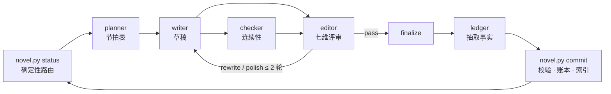

# novel-harness：用 AI Agent 写长篇小说

**简体中文** · [English](README.en.md)

[](LICENSE)
[](https://www.python.org/)
[](tools/novel.py)
[](#claude-code-插件)

一套在 Claude Code 里写长篇小说的工具：七个子智能体分别负责规划、写作、核对、评审和记账，
再加一个纯 Python 的事实层，记录时间线、故事线、人物知道什么和文风统计。
目标是一百章以上的中文长篇，题材不限。Cursor、Codex、OpenCode、Antigravity、Pi 也能用。

## 为什么做这个

用大模型写短篇问题不大，写到第 80 章就开始乱：第 12 章那把匕首给了谁、老周知不知道主角的身份、
三卷前埋的伏笔收没收，模型都记不住。人设走样、时间线打架、伏笔烂尾，根子上是把连续性交给了模型的上下文。

所以这里的做法是记账。每章定稿后，账本员把结构化事实抽出来（谁在哪、故事里第几天、谁知道了什么、哪条线往前走了），
写进只允许代码改的账本。下一章开写前，工具按需把相关前情、人物状态、待收的伏笔检索出来交给写手。
前后矛盾由代码报错。

## 功能

- 七个角色的流水线：architect 规划卷和弧，planner 写节拍表，writer 写正文，checker 核对连续性，
  editor 从七个维度评审并给出修改意见，ledger 抽取事实，judge 盲比修订前后两版。
- 事实层 `tools/novel.py`，单文件，只用标准库：
  - 进度路由和上下文装配
  - SQLite FTS5 场景级全文检索，用 CJK bigram 分词，「老周」这种两字人名也搜得到
  - 按「故事内第几天」计数的时间线校验
  - 故事线台账，每条线记录承诺和兑现窗口
  - 人物知识账本：每个人物此刻知道什么
  - 疲劳词和套句的文体统计
- 人工闸门有三档：每弧停、每章停、全自动。设定生成后一定会停下来等你看。
- 写作途中随时插话：改文风、改走向、返工某一章、写到第 N 章为止。
- 草稿落盘后自动 lint，事实文件落盘后自动校验，问题直接交回模型修。
- 一份角色定义，按运行时生成 Claude Code、Cursor、Codex、OpenCode、Antigravity、Pi 各自的子智能体文件。
- 账本是 JSON / JSONL，正文是 Markdown，整个工作区就是一个 git 仓库，随时可以翻旧账。

## 架构

事实层只做能用代码判定的事，判断类的事交给角色。

| | 事实层 | 语义层 |
|---|---|---|
| 谁负责 | `tools/novel.py`（标准库，单文件） | `agents/` 下的七个角色 |
| 做什么 | 进度路由、时间先后、故事线到期、知识账本、文体统计、事实校验 | 规划、写作、核对、评审、抽取 |
| 结果 | 代码判定，结果唯一 | 靠判断，允许有分歧 |

主会话只负责调度：读事实，查路由，派子智能体，校验产物，推进状态。它不写正文，不做文学判断，也不手改账本。



### 插件和工作区

```
novel-harness（本仓库，装一次）          my-novel/（每部小说一个目录，init 生成）
├── agents/      七个角色               ├── CLAUDE.md        指向 docs/protocol.md 的入口
├── skills/      七个 /novel-* 入口     ├── docs/protocol.md 调度协议   ┐ 随版本复制
├── hooks/       写入后校验钩子         ├── docs/schemas.md  数据契约   │ upgrade 刷新
├── tools/novel.py                      ├── tools/novel.py              ┘
├── docs/        protocol + schemas     ├── bible/ outline/ threads/   权威设定（architect 写）
└── templates/workspace/  种子文件      ├── chapters/ plans drafts reviews final facts
                                        └── ledger/ state/ summaries/ index/   只由 novel.py 写
```

每个工作区自带一份 `tools/novel.py` 和数据契约，版本和它的数据格式对应。插件升级不会改变已有小说的行为，
想升级时在工作区里运行 `python3 <插件目录>/tools/novel.py upgrade`。
0.1.0 的工作区（`tools/` 软链到插件目录、根目录带 `agents/` 和旧协议）也走 `upgrade` 或 `init`：
软链换成实体文件，角色副本移除，`CLAUDE.md` / `AGENTS.md` 换成工作区模板。

## 安装

需要 Python 3.10+，只用标准库，不用 `pip install`。

### Claude Code 插件

仓库自带插件市场：

```
/plugin marketplace add hoobnn/novel-harness
/plugin install novel-harness@novel-harness
```

本地开发或试用：`git clone` 后 `claude --plugin-dir ./novel-harness`。

### npx skills 安装

Cursor、Codex、OpenCode、Antigravity、Pi 用这种方式；不想装插件的 Claude Code 用户也可以。

```bash
npx skills add hoobnn/novel-harness
```

这一步只装 7 个 skill。第一次运行 `novel-init` 时，`init.sh` 发现自己不在插件目录里，
会把本仓库浅克隆到 `~/.cache/novel-harness/src`，再以 standalone 模式初始化：按运行时生成七个角色的子智能体定义、
复制 skill、写入钩子。之后 `python3 tools/novel.py upgrade` 从这个缓存刷新。
设置 `NOVEL_HARNESS_SRC` 指向已有的仓库目录可以跳过克隆；`--runtime cursor,codex` 只生成指定运行时的文件。

| 运行时 | skill 入口 | 子智能体定义（standalone 生成） | 派发写法 |
|---|---|---|---|
| Claude Code 插件 | `/novel-harness:novel-next` | 插件自带 | Agent 工具，`novel-harness:writer` |
| Claude Code standalone | `/novel-next` | `.claude/agents/*.md` | Agent 工具，`writer` |
| Cursor | `/novel-next` | 原生读取 `.claude/agents/` | `/writer` 或自然语言点名 |
| Codex | `$novel-next` | `.codex/agents/*.toml` | 指令里点名角色 |
| OpenCode | `skill` 工具 | `.opencode/agents/*.md` | `@writer` |
| Antigravity | `/novel-next` | `.agents/agents/*.md` | `invoke_subagent` |
| Pi | `/skill:novel-next` | `.pi/agents/*.md`（需装官方 subagent 扩展） | 自然语言点名 |

各运行时的目录、字段映射、核实来源和还没实测的部分见 [`docs/runtimes.md`](docs/runtimes.md)。

### 什么都不装

在小说目录里运行 `python3 /path/to/novel-harness/tools/novel.py init --standalone`，
角色和 skill 会生成到这个目录下，slash 命令去掉 `novel-harness:` 前缀。

## 快速开始

在一个空目录（你的小说目录）里打开 Claude Code：

```
/novel-harness:novel-init 写一部东方玄幻长篇，主角从边陲小城起步，目标 200 章
```

它会建好工作区，让架构师生成基础设定：前提、世界规则、日历、人物卡、故事线、第一弧大纲、文风标准。
然后停下来，等你看 `bible/` `outline/` `threads/`。改到满意再往下写：

```
/novel-harness:novel-next                      # 按闸门推进（默认每弧停一次）
/novel-harness:novel-next 20                   # 一直写到第 20 章
/novel-harness:novel-status                    # 进度、故事线状态、文体统计
/novel-harness:novel-steer 感情线提前到第 4 章  # 插入调整
/novel-harness:novel-sync                      # 手改了 chapters/final 之后重建账本
/novel-harness:novel-arc-review v1a2           # 补做或重做弧级 / 卷级评审
/novel-harness:novel-preview                   # 打开本地 Web 预览台
```

预览台（`python3 tools/novel.py serve`）是一个只绑本机的网页：总览页有章节进度、下一步路由和故事线健康度，
Agent 写入的产物几秒内就会出现。设定、大纲、计划、草稿、定稿可以直接在网页里改，
保存时会检查冲突，Agent 刚写过的文件不会被旧版本覆盖。选中正文可以批注，未处理的批注会进入该章的上下文包；
勾选「交给 Agent」后，批注会变成一条干预，下一轮优先处理。

工作区最好是 git 仓库。每章 commit 后主会话会跑一次 `git commit`，每次改动都能追溯。

## 角色和每章流程

| 角色 | 输入 | 产物 |
|---|---|---|
| architect 架构师 | 需求 / 前情 / 故事线台账 | `bible/` `outline/` `threads/` |
| planner 章节规划 | `context N --for planner` | `chapters/plans/chNNNN.md` |
| writer 写手 | 章节计划 + 上下文包 | `chapters/drafts/chNNNN.md` |
| checker 连续性检查 | 草稿 + 账本 | `chapters/reviews/chNNNN.check.json` |
| editor 编辑 | 草稿 + 检查结论 | `chapters/reviews/chNNNN.json`、弧 / 卷摘要 |
| ledger 账本员 | 定稿 | `chapters/facts/chNNNN.json` |
| judge 盲比评审 | 同一章的两个版本 | 盲比结论 |

architect、planner、writer、editor、judge 用主会话模型；ledger 和 checker 做抽取与核对，用便宜一些的模型，
可以在 `agents/*.md` 的 `model` 字段里改。

```
planner → writer → (checker ∥ editor) → 修订 ≤ 2 轮 → finalize → ledger → commit
```

- 弧末：editor 做弧级评审，写弧摘要、角色快照和风格规则，然后 architect 展开下一弧。
- 卷末：写卷摘要，architect 追加新卷或者收尾。

在哪里停下来等人由闸门（`progress.gate`）决定：`per-arc`（默认）、`per-chapter`、`auto`。
完整调度协议见 [`docs/protocol.md`](docs/protocol.md)。

## 事实层命令

在工作区内任意目录运行：

```bash
python3 tools/novel.py status                    # 进度 + 下一步路由
python3 tools/novel.py context 12 --for writer   # 装配第 12 章上下文包
python3 tools/novel.py search "铁匠铺" --before 12 # 场景级全文检索
python3 tools/novel.py recall --entity 老周       # 召回某实体的全部账本
python3 tools/novel.py timeline --entity 林越     # 时间线查询
python3 tools/novel.py threads --stale           # 停滞与超期的故事线
python3 tools/novel.py check 12                  # 连续性检查
python3 tools/novel.py lint 12                   # 文体机械检查
python3 tools/novel.py stylestat                 # 全书文体统计
python3 tools/novel.py commit 12                 # 提交定稿并更新账本
python3 <插件目录>/tools/novel.py upgrade        # 刷新工作区的 novel.py / 钩子 / 契约
```

完整子命令见 `python3 tools/novel.py --help`。

## 常见问题

**能写多长？**
按百章级长篇设计。上下文包按需装配，不会把整本书塞进一个窗口，章数多了也不会撑爆上下文。

**支持哪些题材和语言？**
题材不限，玄幻、悬疑、言情、科幻、历史走的是同一套流程，文风标准由 architect 按题材和你的偏好生成。
事实层的分词和文体规则是按中文做的，正文用什么语言由你决定。

**写到一半想改人设或走向？**
用 `/novel-harness:novel-steer`。偏好类的会加进用户规则；走向类的由 architect 增量改大纲；
返工类的由 editor 圈出需要改的最少章节，逐章修订并重新抽取事实。

**手改了正文，账本会不会过期？**
跑一次 `/novel-harness:novel-sync`，它会找出改动过的定稿，重新抽取事实并重建索引。

**必须用 Claude 吗？**
不用。角色提示词和事实层不绑定模型，上面运行时表里列的都能跑。

**写出来的小说归谁？**
所有文件都在你自己的目录里。MIT 协议只约束这个工具本身，不管你写的内容。

## 致谢

思路参考了 [voocel/ainovel-cli](https://github.com/voocel/ainovel-cli)。在它的基础上我加了场景级全文检索、
按故事内天数校验的时间线、带兑现窗口的故事线台账、人物知识账本、独立的 checker / ledger 角色和 judge 盲比，
并改成了可以通过插件市场和 `npx skills` 分发的形式。

## 开发

```bash
python3 tests/smoke_test.py                       # 脚手架、路由、钩子两种载荷、upgrade、各运行时生成
claude plugin validate . --strict                 # 市场清单
claude plugin validate skills --strict            # skills
claude plugin validate agents --strict            # 角色
claude plugin validate .claude-plugin/plugin.json # 插件清单（根目录 CLAUDE.md 是贡献者指南，会有一条预期内的警告）
```

贡献者指南见 [`CLAUDE.md`](CLAUDE.md)，数据契约见 [`docs/schemas.md`](docs/schemas.md)，
运行时适配见 [`docs/runtimes.md`](docs/runtimes.md)。欢迎提 issue 和 PR。

## 许可

[MIT](LICENSE) © hoobnn
