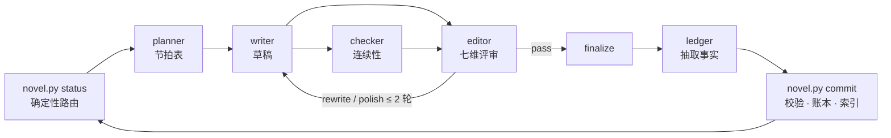

# novel-harness：用 AI Agent 团队写长篇小说，不靠模型记忆，靠账本

> **AI 长篇小说创作框架**。七个子智能体分工规划、写作、核对、评审、记账，一个纯 Python 事实层管住时间线、故事线、人物知识与文风。
> 以 **Claude Code 插件**一键安装；**Cursor、Codex、OpenCode、Antigravity、Pi** 经 `npx skills` 安装。支持中文网文、玄幻、悬疑、言情等任意题材的百章级长篇。

[](LICENSE)
[](https://www.python.org/)
[](tools/novel.py)
[](#claude-code-插件)
[](#npx-skills-安装)
[](https://github.com/hoobnn/novel-harness/stargazers)

**English:** novel-harness is a multi-agent harness for writing long-form fiction (100+ chapters) with coding agents.
Seven role agents (architect, planner, writer, checker, editor, ledger, judge) do the creative work;
a zero-dependency Python fact layer owns routing, timeline validation, plot-thread registry, per-character knowledge ledger,
scene-level full-text search and style linting, so chapter 80 stays consistent with chapter 12.
Installs as a Claude Code plugin, or via `npx skills add hoobnn/novel-harness` for Cursor, Codex, OpenCode, Antigravity and Pi.

---

## 目录

- [AI 写长篇小说为什么会崩](#ai-写长篇小说为什么会崩)
- [核心特性](#核心特性)
- [架构设计：事实层确定，语义层自主](#架构设计)
- [安装](#安装)
- [快速开始](#快速开始)
- [七个角色与每章流水线](#七个角色与每章流水线)
- [事实层命令](#事实层命令)
- [常见问题 FAQ](#常见问题-faq)
- [与其他 AI 小说工具的区别](#与其他-ai-小说工具的区别)
- [开发与贡献](#开发与贡献)

## AI 写长篇小说为什么会崩

用大模型写短篇很容易，写到第 80 章就会出事：模型早已不记得第 12 章那把匕首给了谁、老周到底知不知道主角的身份、
三卷前埋的伏笔有没有兑现。人设崩塌、时间线打架、伏笔烂尾、文风越来越「AI 味」，都是同一个原因：**把连续性交给了模型的记忆**。

novel-harness 的答案是：**不靠模型记忆，靠账本**。每章定稿后由账本员抽取结构化事实（谁在哪、第几天、谁知道了什么、哪条线推进了），
写入只许代码修改的账本；下一章开写前，工具按需装配上下文包，把相关前情、人物状态、待兑现的伏笔检索出来喂给写手。
矛盾由代码报错，而不是靠模型「记得」。

## 核心特性

- **七角色子智能体流水线**：architect 规划卷弧、planner 写节拍表、writer 写正文、checker 核对连续性、editor 七维评审并给出可执行修改指令、ledger 抽取事实、judge 盲比修订前后。
- **确定性事实层**（`tools/novel.py`，单文件、仅标准库）：进度路由、上下文装配、SQLite FTS5 场景级全文检索（CJK bigram 分词，「老周」这类两字人名也能检索）、以「故事内第几天」计数的时间线校验、带承诺与兑现窗口的故事线注册表、每个人物「此刻知道什么」的知识账本、疲劳词与套句的文体统计。
- **人工闸门**：每弧 / 每章 / 全自动三档，设定生成后必停下让你审阅。
- **用户随时干预**：改文风、改走向、返工某章、写到第 N 章为止，一句话注入。
- **写入后自动校验**：草稿一落盘就 lint，事实文件一落盘就校验，问题直接回传给模型修复。
- **多运行时**：一份角色源，按运行时生成 Claude Code、Cursor、Codex、OpenCode、Antigravity、Pi 各自的子智能体定义。
- **零依赖、可审计**：所有账本是 JSON / JSONL，正文是 Markdown，整个工作区就是一个 git 仓库。

## 架构设计

原则：**事实层确定，语义层自主**。

| | 事实层 | 语义层 |
|---|---|---|
| **谁负责** | `tools/novel.py`（纯 Python 标准库，单文件） | `agents/` 下的七个角色 |
| **做什么** | 进度路由、时间线先后、线程到期、知识账本、文体统计、事实校验 | 规划、写作、核对、评审、抽取 |
| **判定方式** | 代码判定，结果唯一 | judgement，允许分歧 |

主会话只做调度：读事实 → 查路由 → 派发子智能体 → 校验产物 → 推进状态。它不写正文、不做文学判断、不手改账本。



### 两层结构：插件与工作区

```
novel-harness（本仓库，装一次）          my-novel/（每部小说一个目录，init 生成）
├── agents/      七个角色               ├── CLAUDE.md        指向 docs/protocol.md 的入口
├── skills/      六个 /novel-* 入口     ├── docs/protocol.md 调度协议   ┐ 随版本复制
├── hooks/       写入后校验钩子         ├── docs/schemas.md  数据契约   │ upgrade 刷新
├── tools/novel.py                      ├── tools/novel.py              ┘
├── docs/        protocol + schemas     ├── bible/ outline/ threads/   权威设定（architect 写）
└── templates/workspace/  种子文件      ├── chapters/ plans drafts reviews final facts
                                        └── ledger/ state/ summaries/ index/   只由 novel.py 写
```

工作区自带 `tools/novel.py` 与数据契约，和它的数据格式同版本；插件升级不会悄悄改变已有小说的行为，
需要时在工作区里运行 `python3 <插件目录>/tools/novel.py upgrade` 显式刷新。

## 安装

需要 Python 3.10+（仅标准库，无需 `pip install`）。

### Claude Code 插件

本仓库自带插件市场：

```
/plugin marketplace add hoobnn/novel-harness
/plugin install novel-harness@novel-harness
```

本地开发或试用：`git clone` 后 `claude --plugin-dir ./novel-harness`。

### npx skills 安装

适用于 Cursor、Codex、OpenCode、Antigravity、Pi，以及不想装插件的 Claude Code 用户。

```bash
npx skills add hoobnn/novel-harness
```

它只会装 6 个 skill。第一次运行 `novel-init` 时，`init.sh` 发现自己不在插件目录里，会把本仓库浅克隆到
`~/.cache/novel-harness/src`，再以 standalone 模式初始化：按运行时生成七个角色的子智能体定义、复制 skill、
写入钩子。之后 `python3 tools/novel.py upgrade` 会从这个缓存刷新。可用 `NOVEL_HARNESS_SRC` 指向现成的仓库目录跳过克隆；
`--runtime cursor,codex` 这类参数只生成指定运行时的文件。

| 运行时 | skill 入口 | 子智能体定义（standalone 生成） | 派发写法 |
|---|---|---|---|
| Claude Code 插件 | `/novel-harness:novel-next` | 插件自带 | Agent 工具，`novel-harness:writer` |
| Claude Code standalone | `/novel-next` | `.claude/agents/*.md` | Agent 工具，`writer` |
| Cursor | `/novel-next` | 原生读取 `.claude/agents/` | `/writer` 或自然语言点名 |
| Codex | `$novel-next` | `.codex/agents/*.toml` | 指令里点名角色 |
| OpenCode | `skill` 工具 | `.opencode/agents/*.md` | `@writer` |
| Antigravity | `/novel-next` | `.agents/agents/*.md` | `invoke_subagent` |
| Pi | `/skill:novel-next` | `.pi/agents/*.md`（需装官方 subagent 扩展） | 自然语言点名 |

各运行时的目录、字段映射、核实来源与未实测项见 [`docs/runtimes.md`](docs/runtimes.md)。

### 不装任何东西

在小说目录里 `python3 /path/to/novel-harness/tools/novel.py init --standalone`，
角色与 skill 会生成到该目录下，slash 命令去掉 `novel-harness:` 前缀。

## 快速开始

在一个空目录（你的小说目录）里打开 Claude Code：

```
/novel-harness:novel-init 写一部东方玄幻长篇，主角从边陲小城起步，目标 200 章
```

它会建立工作区并派架构师生成基础设定（前提、世界规则、日历、人物卡、故事线、首弧大纲、文风标准），
然后**停下来等你审阅** `bible/` `outline/` `threads/`。改到满意再继续：

```
/novel-harness:novel-next                      # 按闸门推进（默认每弧停一次）
/novel-harness:novel-next 20                   # 一路写到第 20 章
/novel-harness:novel-status                    # 进度、线程健康度、文体统计
/novel-harness:novel-steer 感情线提前到第 4 章  # 注入干预
/novel-harness:novel-sync                      # 手改了 chapters/final 之后重建账本
/novel-harness:novel-arc-review v1a2           # 补做或重做弧级 / 卷级评审
```

工作区建议是 git 仓库：每章 commit 后主会话会 `git commit`，整部小说的每一次修改都可回溯。

## 七个角色与每章流水线

| 角色 | 输入 | 产物 |
|---|---|---|
| **architect** 架构师 | 需求 / 前情 / 线程台账 | `bible/` `outline/` `threads/` |
| **planner** 章节规划 | `context N --for planner` | `chapters/plans/chNNNN.md` |
| **writer** 写手 | 章节计划 + 上下文包 | `chapters/drafts/chNNNN.md` |
| **checker** 连续性检查 | 草稿 + 账本 | `chapters/reviews/chNNNN.check.json` |
| **editor** 编辑 | 草稿 + 检查结论 | `chapters/reviews/chNNNN.json`、弧/卷摘要 |
| **ledger** 账本员 | 定稿 | `chapters/facts/chNNNN.json` |
| **judge** 盲比评审 | 同一章的两个版本 | 盲比结论 |

创作角色（architect / planner / writer / editor / judge）用主会话模型；
抽取与核对角色（ledger / checker）用更便宜的模型，可在 `agents/*.md` 的 `model` 字段调整。

```
planner → writer → (checker ∥ editor) → 修订 ≤ 2 轮 → finalize → ledger → commit
```

- **弧末**：editor 弧级评审 + 弧摘要 + 角色快照 + 风格规则 → architect 展开下一弧
- **卷末**：卷摘要 → architect 追加新卷或宣告收官

闸门（`progress.gate`）控制在哪里停下等人：`per-arc`（默认）、`per-chapter`、`auto`。
完整调度协议见 [`docs/protocol.md`](docs/protocol.md)。

## 事实层命令

在工作区内任意目录运行：

```bash
python3 tools/novel.py status                    # 进度 + 下一步路由
python3 tools/novel.py context 12 --for writer   # 装配第 12 章上下文包
python3 tools/novel.py search "铁匠铺" --before 12 # 场景级全文检索
python3 tools/novel.py recall --entity 老周       # 召回某实体的全部账本
python3 tools/novel.py timeline --entity 林越     # 时间线查询
python3 tools/novel.py threads --stale           # 停滞与超期的故事线
python3 tools/novel.py check 12                  # 连续性检查
python3 tools/novel.py lint 12                   # 文体机械检查
python3 tools/novel.py stylestat                 # 全书文体统计
python3 tools/novel.py commit 12                 # 提交定稿并更新账本
python3 <插件目录>/tools/novel.py upgrade        # 刷新工作区的 novel.py / 钩子 / 契约
```

完整子命令见 `python3 tools/novel.py --help`。

## 常见问题 FAQ

**能写多长？** 设计目标是百章级长篇。上下文包按需装配，不把整本书塞进任何一个窗口，章数增长不会撑爆上下文。

**支持哪些题材和语言？** 题材不限，玄幻、悬疑、言情、科幻、历史都走同一套流水线；文风标准由 architect 按题材与你的偏好生成。
事实层的分词与文体规则针对中文，正文语言由你的需求决定。

**写到一半想改人设或走向怎么办？** 一句 `/novel-harness:novel-steer`。偏好类追加到用户规则，走向类由 architect 增量改大纲，返工类由 editor 圈定最小章节集合逐章修订并重抽事实。

**我手改了正文，账本会过期吗？** 跑 `/novel-harness:novel-sync`，它检测被改动的定稿、重新抽取事实并重建索引。

**必须用 Claude 吗？** 不必。角色提示词与事实层和模型无关；Cursor、Codex、OpenCode、Antigravity、Pi 都能跑，见上面的运行时表。

**生成的小说归谁？** 全部文件在你自己的目录里，MIT 协议对工具本身不附加任何内容限制。

## 与其他 AI 小说工具的区别

参考并改进自 [voocel/ainovel-cli](https://github.com/voocel/ainovel-cli)，新增：

- **场景级全文检索** —— SQLite FTS5 + CJK bigram 分词，两字人名也能检索到
- **机械校验的时间线** —— 以「故事内第几天」计数，先后矛盾由代码报错
- **故事线注册表** —— 每条线带承诺与兑现窗口，超期自动进入 `--stale`
- **知识账本** —— 每个人物「此刻知道什么」的投影，杜绝角色提前知情
- **独立的 checker 与 ledger 角色** —— 核对与抽取和创作解耦
- **盲比评审** —— judge 匿名比对修订前后，判断改动是否真的更好
- **可分发** —— Claude Code 插件市场 + `npx skills`，一份角色源适配六个运行时

## 开发与贡献

```bash
python3 tests/smoke_test.py                       # 脚手架、路由、钩子两种载荷、upgrade、各运行时生成
claude plugin validate . --strict                 # 市场清单
claude plugin validate skills --strict            # skills
claude plugin validate agents --strict            # 角色
claude plugin validate .claude-plugin/plugin.json # 插件清单（根目录 CLAUDE.md 是贡献者指南，会有一条预期内的警告）
```

贡献者指南见 [`CLAUDE.md`](CLAUDE.md)，数据契约见 [`docs/schemas.md`](docs/schemas.md)，运行时适配见 [`docs/runtimes.md`](docs/runtimes.md)。
欢迎 issue 与 PR。

## 许可协议

[MIT](LICENSE) © hoobnn
